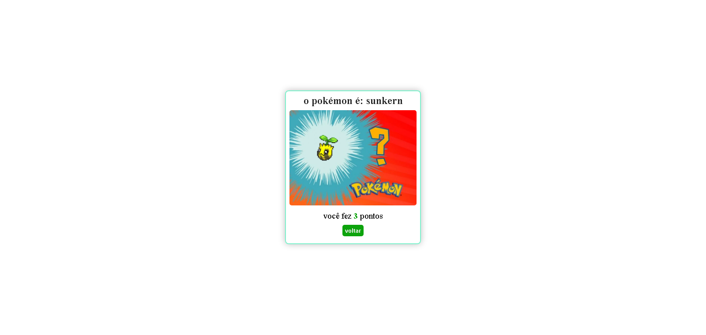

<h1 style='text-align: center'>Pokémon quiz</h1>

## Um simples quiz sobre pokémon, feito em ReactJS. O quiz possui 10 perguntas divididas em fácil(3), médio(3) e difícil(4).

<div>
  
  
  
</div>

## Para rodar o projeto localmente você precisa rodar os seguintes comandos:

```bash
npm install
npm run dev
```

Depois disso, acesse o link indicado no seu terminal ou acesse o site online <a href='https://pokemon-quiz-six.vercel.app/'>aqui</a>.